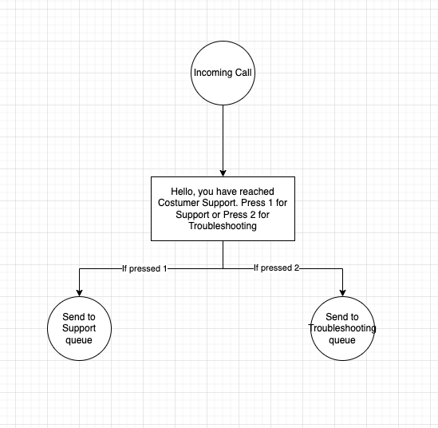

Test Plugin for Twilio Integration
==================================

Welcome to our Test Plugin for Twilio Integration README. This document serves as a guide for potential candidates looking to join our company through the completion of specific Twilio-based tasks. Each task is designed to assess your ability to work with Twilio's services, specifically focusing on Studio Flows, Workflows, Plugins, and Functions. This assignment will require you do some digging into Twilio and its documentation. This is so we can see your ability to work independently, and your ability understand Twilio and its products as opposed to your skills as a developer. Overall this assignment shouldn't take more than 20 hours to complete. After sending this I hope to recieve an answer back after about a week where we can schedule a review meeting together with me and another developer. Whenever you start please send me a message and i will send you an invite to a twilio account. Good luck! 

Prerequisites
-------------

Before you begin, ensure you have the following:

*   A Twilio account.
*   Twilio CLI installed. Follow the installation guide.
*   Node.js installed. [Download Node.js](https://nodejs.org/).

Tasks Overview
--------------

### Task 1: Create a Simple Studio Flow IVR

**Objective:** Implement a Studio Flow IVR (Interactive Voice Response) system that allows callers to interact through a series of voice menus and messages. The Goal here is to build a very simple IVR
that enables customers to listen to a message and choose 1 of 2 options. The flow should look something like this:

**Documentation:** [Studio Flows Guide](https://www.twilio.com/docs/studio)

### Task 2: Create a New Workflow for Call Routing

**Objective:** Create the 2 queues and create a workflow that routes the tasks from the IVR into of the 2 queues. (Troubleshooting or Support)

**Documentation:** [TaskRouter Workflows](https://www.twilio.com/docs/taskrouter/workflow-configuration), [Setup Queues](https://www.twilio.com/docs/taskrouter/quickstart/python/setup-add-task-queues)

### Task 3: Create a Plugin for Automatic Task Acceptance

**Objective:** Develop a plugin that automatically accepts incoming tasks, facilitating immediate processing.

**Documentation:** [Flex UI](https://www.twilio.com/docs/flex/developer/ui-and-plugins), [Actions Framework](https://assets.flex.twilio.com/docs/releases/flex-ui/2.0.0-beta.1/ui-actions/Actions), [Task Lifecycle](https://twilio.com/docs/taskrouter/lifecycle-task-state), 

### Task 4: Implement a Function to Send SMS Messages

**Objective:** Write a Twilio Function that accepts a 'To' number and a message body as parameters, and sends an SMS to that number with the given message body.

**Documentation:** [Send and SMS](https://www.twilio.com/docs/messaging/api/message-resource#send-an-sms-message), [Create a Service](https://www.twilio.com/docs/serverless/functions-assets/functions/create-service)

### Task 5: Trigger SMS on Call Completion

**Objective:** After hanging up the call through Flex, I would like and SMS to be sent to that customer with a thank you message.

Submission Guidelines
---------------------

*   Clone this repo 
*   Complete the tasks in your cloned repository.
*   Ensure your code is well-documented and includes comments explaining your logic and decisions.
*   After we scheduled a review meeting please send me the link to your repo

Evaluation Criteria
-------------------

*   Code quality and clarity.
*   Adherence to Twilio best practices.
*   Creativity in solution design.
*   Completeness of the implemented tasks.

Thank you for participating in this test. We look forward to reviewing your submission and potentially welcoming you to our team!

* * *
